# CCC 멘토-멘티 매칭

고3 수험생(예비 대학생)과 CCC 재학생을 캠퍼스·관심 영역·성향으로 이어주는 모바일 웹 서비스입니다.

**고3채플 — 2026년 11월 26일 (목) · 신길교회**

날짜는 `src/shared/constants/venue.ts` 의 `EVENT_DATE` 한 곳에서만 고칩니다.
멘토링 신청은 채플이 끝난 뒤에도 계속 열려 있고, 날짜를 전제하는 문구만
`isAfterEvent()` 로 갈립니다 — 지난 날을 기다리라고 안내하지 않기 위해서입니다.

---

## 문서

| 문서 | 내용 |
| --- | --- |
| [docs/DEPLOYMENT.md](docs/DEPLOYMENT.md) | 배포 계획 · 오픈 순서 · 검증 일정 |
| [docs/REHEARSAL.md](docs/REHEARSAL.md) | 예비 배포와 검증 절차 (운영진용) |

---

## 목차

1. [빠르게 실행하기](#빠르게-실행하기)
2. [화면 구성과 주소](#화면-구성과-주소)
3. [가입은 두 단계입니다](#가입은-두-단계입니다)
4. [1단계 — 고3채플 등록](#1단계--고3채플-등록)
5. [2단계 — 멘토링 신청](#2단계--멘토링-신청)
6. [참여코드 조회](#참여코드-조회)
7. [매칭 결과 화면](#매칭-결과-화면)
8. [운영자 화면](#운영자-화면)
9. [매칭 알고리즘](#매칭-알고리즘)
10. [프로젝트 구조](#프로젝트-구조)
11. [현재 한계와 다음 작업](#현재-한계와-다음-작업)

---

## 빠르게 실행하기

```bash
npm install
npm run dev        # http://localhost:3000
```

| 명령 | 설명 |
| --- | --- |
| `npm run dev` | 개발 서버 |
| `npm run build` | 프로덕션 빌드 |
| `npm start` | 빌드된 결과 실행 |
| `npm run typecheck` | 타입 검사 |
| `npm run check:db` | **DB 스키마가 코드와 맞는지** — 배포 전 필수 |
| `npm run verify` | 매칭 알고리즘 검증 (멘토 50 × 멘티 50 = 2,500조합) |
| `npm run verify:flow` | API·DB·보안이 실제로 맞물려 도는지 (서버 필요) |
| `npm run seed:demo` | 검증용 멘토 10명 투입 (`-- --clean` 으로 정리) |
| `npm run reset-data` | 신청 데이터 삭제 (`-- --yes` 를 붙여야 실제 실행) |
| `npm run purge -- --event-end YYYY-MM-DD` | 보유 기간이 지난 데이터 파기 |

학과 데이터를 다시 만들 때만 쓰는 명령이 하나 더 있습니다.

```bash
python3 scripts/build-campus-majors.py   # 대학알리미 공시자료 -> campusMajors.generated.ts
```

> **주의** — 개발 서버가 떠 있는 상태에서 `npm run build`를 돌리면 `.next`를 덮어써서
> 청크가 깨지고 화면이 반응하지 않습니다. 빌드 전에 개발 서버를 먼저 종료하세요.

**기술 스택**: Next.js 15 (App Router) · React 19 · TypeScript · Tailwind CSS v4 · Anime.js v4 · Supabase

---

## 화면 구성과 주소

| 주소 | 보는 사람 | 설명 |
| --- | --- | --- |
| `/` | 참가자 | 고3채플 안내 + 등록 시작 |
| `/onboarding/register` | 참가자 | **1단계** 등록 4스텝 (역할 공통) |
| `/onboarding/complete` | 등록자 | 참여코드 발급 + 멘토링 권유 |
| `/onboarding/mentoring/mentee` | 고3 학생 | **2단계** 멘토링 신청 8스텝 |
| `/onboarding/mentoring/mentor` | CCC 재학생 | **2단계** 멘토링 신청 8스텝 |
| `/onboarding/mentoring/complete` | 신청자 | 신청 완료 + 매칭 결과로 |
| `/matching/result` | 멘티 | 매칭된 멘토 카드 |
| `/venue` | 참가자 | 오시는 길 · 만날 장소 |
| `/lookup` | 등록자 | 이름·연락처로 참여코드 조회 |
| `/admin` | 운영자 | 신청 현황·매칭 결과 |

`/onboarding/mentee` 와 `/onboarding/mentor` 는 예전 주소입니다. 등록이 역할과
무관해지면서 `/onboarding/register` 로 합쳤고, 이미 나간 QR·링크가 깨지지 않도록
307 리다이렉트만 남겨 두었습니다.

`/admin`은 **참가자 화면 어디에도 링크되어 있지 않습니다.** 참가자에게
관리자 화면이 노출되면 안 되기 때문이며, 운영자는 주소를 직접 입력해 들어갑니다.

---

## 가입은 두 단계입니다

```
/ 고3채플 안내
│
1단계 · 등록 (4스텝)            ← 채플에 오는 모든 사람
│   동의 → 이름·연락처 → 신분 → 교회
│
참여코드 발급
│
2단계 · 멘토링 신청 (8스텝)     ← 원하는 사람만
│   멘티: 안내 → 성경인물 → MBTI → 관심영역 → 지망캠퍼스 → 희망학과 → 시간대 → 사진
│   멘토: 안내 → 성경인물 → MBTI → 도와줄영역 → 재학캠퍼스 → 전공 → 시간대 → 사진
│
매칭 결과
```

**왜 나눴나** — 한 번에 다 물으면 등록만 하려는 사람도 성경 인물과 MBTI부터
답해야 합니다. 거기서 등록 자체를 포기합니다. 1단계만 마쳐도 채플에는 올 수 있고,
멘토링은 원하는 사람이 이어서 신청합니다.

**1단계는 역할과 무관하게 같은 질문을 받습니다.** 채플에 오는 데 필요한 정보만 묻기
때문입니다. 고3인지 대학생인지는 명단을 나누려고 받아두되, 질문이 갈라지는 것은
2단계부터입니다 — 캠퍼스는 매칭에 쓰는 정보이지 채플에 오는 데 필요한 정보가 아닙니다.

---

## 1단계 — 고3채플 등록

`/onboarding/register`. 한 화면에 질문 하나씩 묻고, **하단 CTA는 항상 화면에 고정**됩니다.

| | 화면 | 설명 |
| --- | --- | --- |
| 0 | 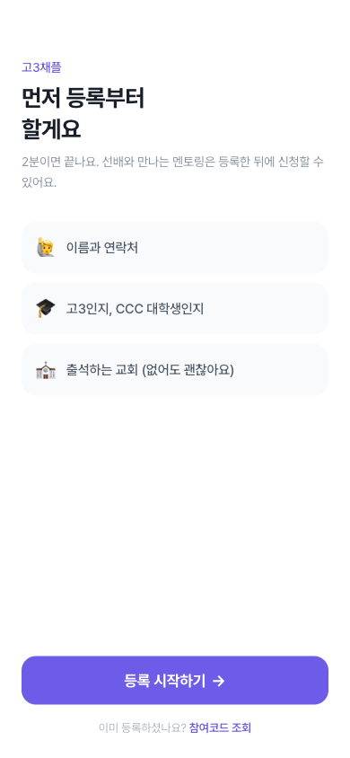 | **랜딩** — 무엇을 묻는지 미리 알려주고 진입점은 하나입니다 |
| 1/4 | 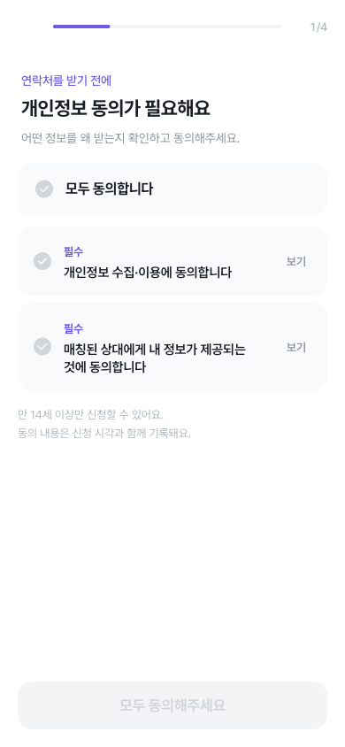 | **개인정보 동의** — 필수 2건. 동의 시각과 문구 버전이 함께 기록됩니다 |
| 2/4 | 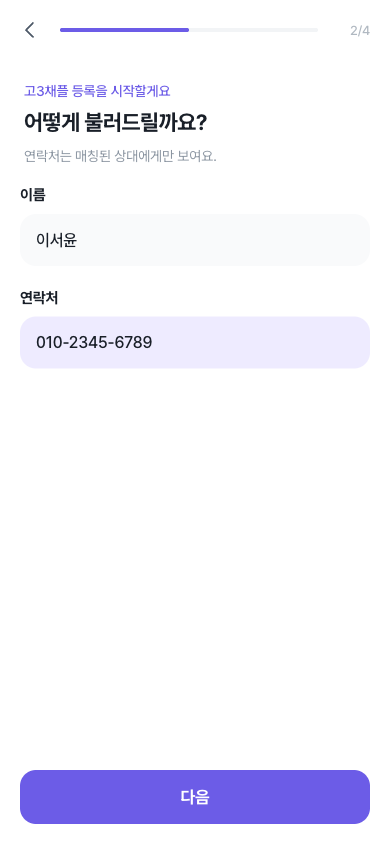 | **이름 · 연락처** — 이것만 받습니다. 성별·고등학교를 여기서 물으면 문턱만 높아집니다 |
| 3/4 | 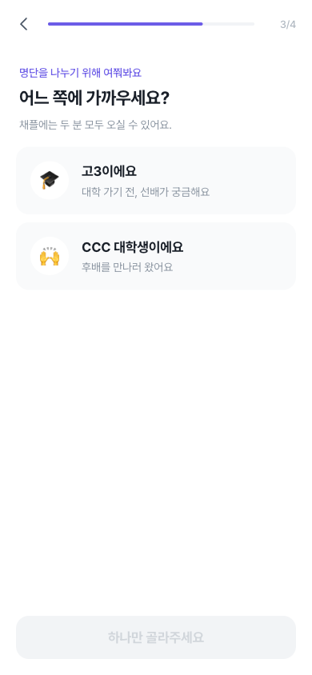 | **신분** — 고3이에요 / CCC 대학생이에요. 이 답이 `users.role` 이 됩니다 |
| 4/4 | 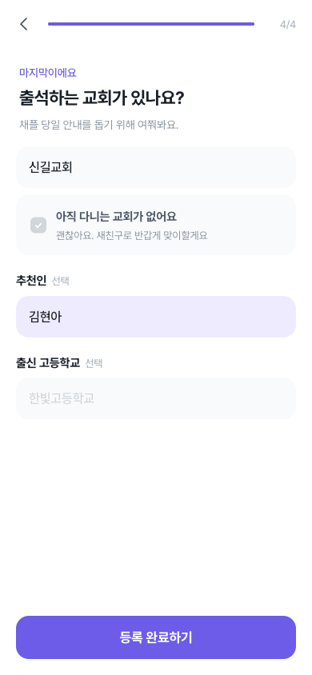 | **출석 교회** — 없으면 체크 한 번으로 새친구 분류. 추천인·출신 고교는 선택 |
| 완료 | 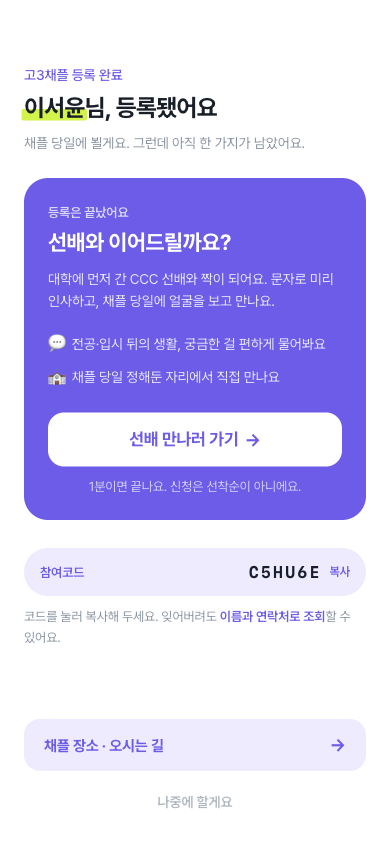 | **참여코드 발급** — 화면의 주인공은 멘토링 권유입니다 |

→ `POST /api/signup` → **참여코드 발급** → 완료 화면에서 멘토링 신청 여부를 정합니다.

**"멘티/멘토"로 묻지 않는 이유** — 이 시점에는 아직 멘토링을 신청하지도 않았습니다.
등록만 하러 온 사람에게 프로그램 용어로 자기를 분류하라고 하면 무엇을 고르는 건지
알 수 없습니다. 신분으로 물으면 답이 분명해집니다.

---

## 2단계 — 멘토링 신청

`/onboarding/mentoring/{mentee,mentor}`. 선택이며, 8스텝입니다.

### 멘티 (고3)

| | 화면 | 설명 |
| --- | --- | --- |
| 1/8 | 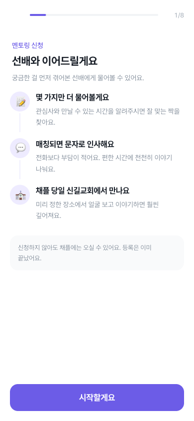 | **안내** — 선배와 무엇을 하게 되는지 먼저 설명합니다 |
| 2/8 | 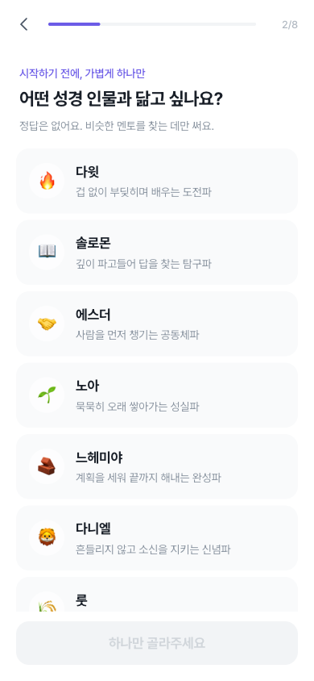 | **성경 인물** — "닮고 싶나요?" 8종 |
| 3/8 | 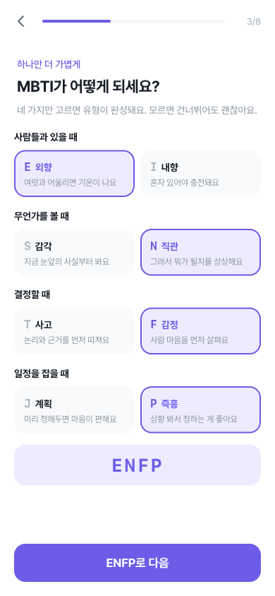 | **MBTI** — 4축을 고르면 유형이 완성됩니다. 건너뛸 수 있어요 |
| 4/8 | 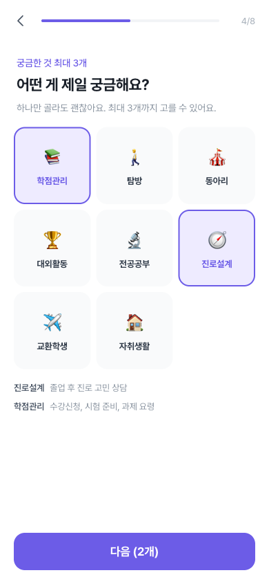 | **관심 영역** — 궁금한 것, 최대 3개 |
| 5/8 | 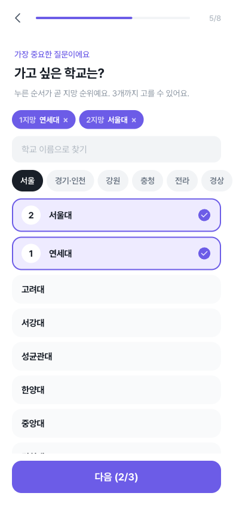 | **지망 캠퍼스** — 누른 순서가 곧 1·2·3지망 |
| 6/8 | 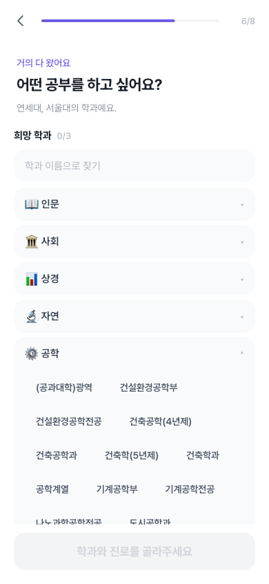 | **희망 학과** — 앞에서 고른 학교의 실제 학과가 계열별로 |
| 6/8 | 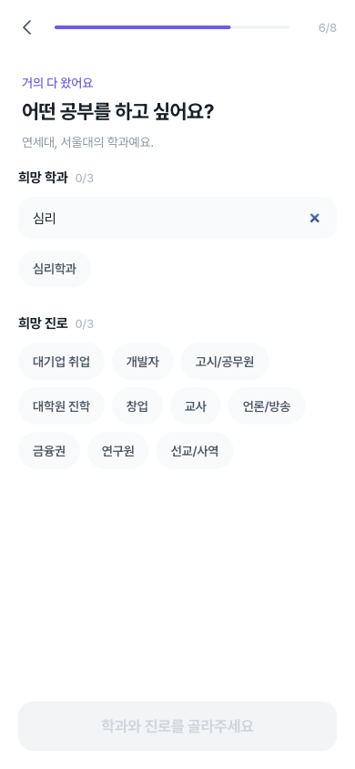 | **학과 검색** — 100개가 넘는 학교가 있어 이름으로 바로 찾습니다 |
| 7/8 | 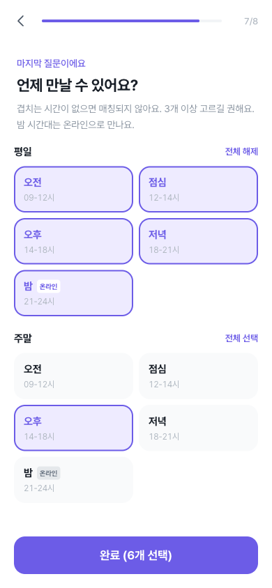 | **가능 시간대** — 평일/주말 × 5구간. 밤(21-24시)은 온라인 뱃지 |
| 8/8 | 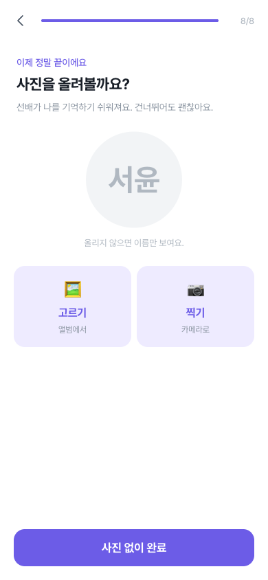 | **프로필 사진** — 선택. 없으면 이름 글자가 보입니다 |
| 완료 | 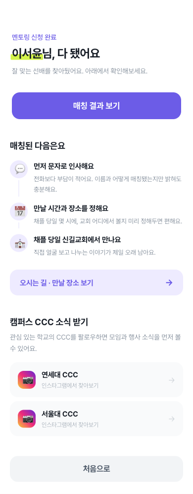 | **신청 완료** — 지망 캠퍼스의 CCC 인스타 링크가 함께 나옵니다 |

### 멘토 (CCC 대학생) — 다른 점만

| | 화면 | 멘티와 다른 점 |
| --- | --- | --- |
| 2/8 | 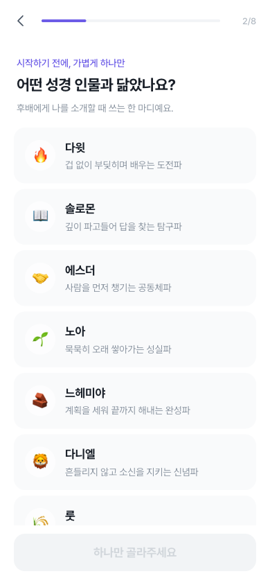 | "닮고 싶나요?" → **"닮았나요?"** (되고 싶은 모습이 아니라 지금의 나) |
| 4/8 | 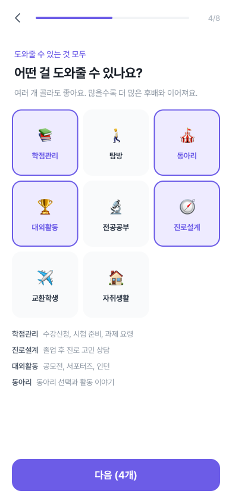 | **개수 제한 없음** — 도울 수 있는 만큼 다 고를 수 있습니다 |
| 5/8 | 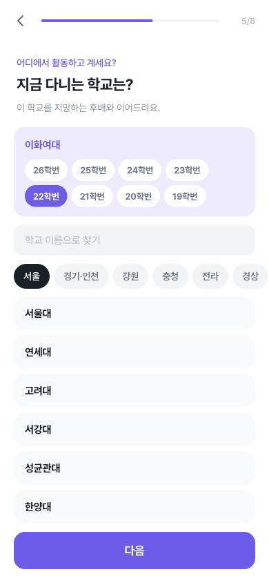 | 3지망이 아니라 **재학 캠퍼스 하나 + 학번** |
| 6/8 | 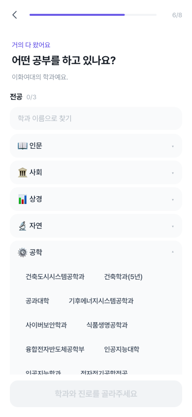 | "희망 학과" → **"전공"**. 그 학교의 실제 학과로 좁혀집니다 |

→ `POST /api/mentoring` → 멘티는 곧바로 매칭 결과로, 멘토는 후배를 기다립니다.

**가벼운 질문을 앞에 둡니다.** 성경 인물·MBTI·관심사는 바로 답할 수 있지만 학교와
학과는 고민이 필요합니다. 첫 질문이 무거우면 거기서 멈춥니다.

**캠퍼스는 학과 바로 앞이어야 합니다.** 학과 선택지가 앞에서 고른 학교로 좁혀지기
때문입니다("연세대의 학과예요"). 순서를 바꾸면 학과 목록을 만들 근거가 사라집니다.

**"최대 3개"는 하나만 골라도 넘어갑니다.** 상한에 닿으면 나머지가 흐려지고,
하나를 해제하면 다시 고를 수 있습니다.

> **학번을 나이 대신 받는 이유** — 나이는 매칭 가중치에 들어가지 않아 신호가 없고,
> 재수·휴학이 흔해 나이로 학번을 역산하면 실제와 어긋납니다. 고3 멘티는 아직 학번이
> 없으므로 멘토에게만 묻습니다.

### 학과 데이터

교육부 대학알리미 「학교별 학부·과(전공) 리스트」(2024.10.07. 기준)에서 생성합니다.
4년제·학사·주간·폐지되지 않은 학과만 남겨 **캠퍼스 100곳 · 학과 3,426개**입니다.

- 학교를 고르면 **그 학교에 실제로 있는 학과만** 나옵니다. 일반 목록을 덧붙이면
  없는 학과를 고르게 되고, 고른 뒤에야 어긋납니다
- 학과가 100개를 넘는 학교가 있어 계열 접기와 **검색**을 함께 둡니다
- 데이터가 138KB라 `campusMajors.ts` 로 분리해 학과 스텝에서만 동적으로 불러옵니다.
  정적으로 import 하면 랜딩까지 이 무게를 지고 시작합니다

```bash
python3 scripts/build-campus-majors.py   # 공시자료가 갱신되면 다시 실행
```

---

## 참여코드 조회

참여코드를 잊었을 때의 흐름입니다. 진입점은 **랜딩 하단**과 **등록 완료 화면**입니다.

| | 화면 | 설명 |
| --- | --- | --- |
| 1 | 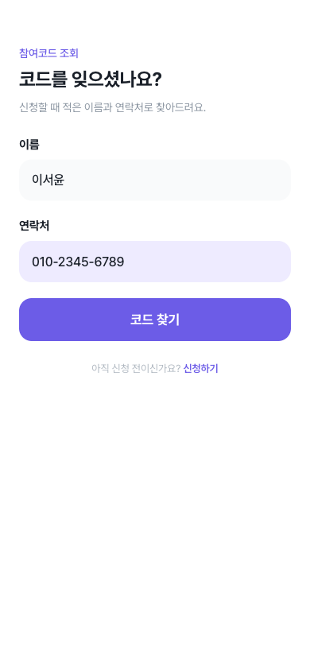 | **코드 조회** — 이름과 연락처 입력 |
| 2 | 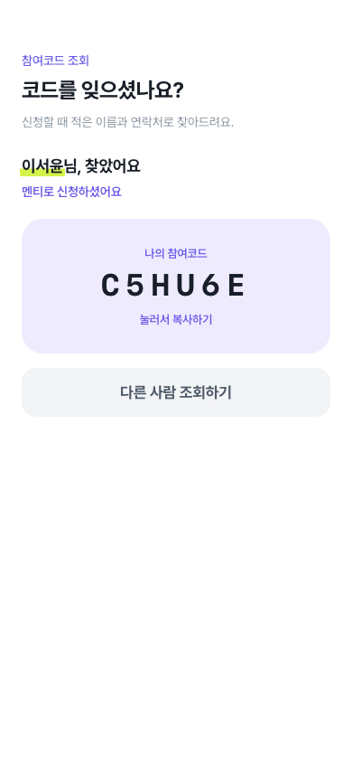 | **조회 성공** — 코드를 눌러 복사. 번호가 틀리면 알려주지 않습니다 |

### 참여코드 규칙

- **6자리**, `ZG5YRP`처럼 구분 기호 없이 표시 (자간을 넓혀 한 글자씩 또렷하게)
- **혼동되는 글자를 뺐습니다** — `0/O`, `1/I/L` 제외. 전화로 불러주거나 손으로 적는 상황을 전제
- `crypto.getRandomValues` 사용 — 같은 순간에 제출한 두 사람이 같은 코드를 받지 않도록
- 코드를 누르면 클립보드에 복사되고 "메모장이나 메시지에 붙여넣어 두세요" 안내가 뜹니다
- 입력받을 때는 하이픈이 섞여 들어와도 정규화해 통과시킵니다

### 조회는 왜 이름 + 번호인가

이름만으로 조회되면 아무나 남의 참여코드를 볼 수 있습니다. 연락처는 본인만 아는
값이라 **둘 다 일치해야** 알려줍니다. 번호는 하이픈 유무와 무관하게 숫자만 비교합니다.

---

## 운영자 화면

`/admin`으로 직접 접속합니다. 열이 12~13개라 **모바일 셸에 가두지 않고 전체 폭**을 씁니다.

| 탭 | 내용 |
| --- | --- |
| **매칭 결과** | 멘티별 상위 3명을 한 행씩 펼쳐 보여줍니다. 점수 근거(캠퍼스·영역·시간대·MBTI·학과/진로·성경인물)가 열로 분리돼 있어 왜 이 순위인지 확인할 수 있습니다 |
| **멘티 신청자** | 참여코드·이름·교회·1~3지망·희망 영역·성향·MBTI·학과·진로·시간대·**멘토링(신청/등록만)**·연락처 |
| **멘토 신청자** | 참여코드·이름·교회·캠퍼스·학번·멘토링 영역·성향·MBTI·학과·진로·시간대·**멘토링**·연락처 |

**등록만 한 사람도 표에 남습니다.** 채플에는 오시는 분들이라 명단에서 빠지면 안 됩니다.
프로필이 없어 캠퍼스·성향 칸은 `-` 로 보입니다.

### 전체 매칭 실행

추천은 원래 **멘티가 결과 화면을 열 때** 계산·저장됩니다. 그래서 멘토링을
신청해 놓고 결과를 안 본 사람은 매칭 표에 한 줄도 없고, 당일 짝 명단이 비게 됩니다.
`전체 매칭 실행` 버튼이 그 빈칸을 채웁니다.

- **멘토링을 신청한 사람만** 대상입니다. 등록만 한 분은 애초에 매칭 대상이 아닙니다
- **짝을 정해 주지 않습니다.** 추천(`SUGGESTED`)만 만들고 누구와 만날지는 멘티가 고릅니다.
  운영자가 임의로 맺어 준 짝은 당사자가 납득하기 어렵고, 1:1이라 되돌릴 수도 없습니다
- **이미 확정(`REQUESTED`)된 멘티는 건너뜁니다.** 다시 계산하면 그 사람이 고른 멘토가
  후보에서 빠져 있어 배정이 흔들립니다

실행하면 숫자로 결과가 나옵니다 — `신청자 N명 / 추천 계산 N명 / 이미 확정 N명 / 조건 맞는 선배 없음 N명`.

> 캡처는 비밀번호 입력이 필요해 아직 넣지 못했습니다.

- **CSV 내보내기** — 화면 표와 같은 열 구성으로 떨어집니다. 엑셀에서 한글이 깨지지
  않도록 UTF-8 BOM을 붙입니다

---

## 매칭 결과 화면

멘티가 2단계를 마치면 바로 보는 화면입니다.

| | 화면 | 설명 |
| --- | --- | --- |
| 1 | 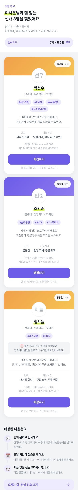 | **적합도 순 카드** — 시간이 안 겹치는 선배는 카드 안에서 따로 알려줍니다 |
| 2 | 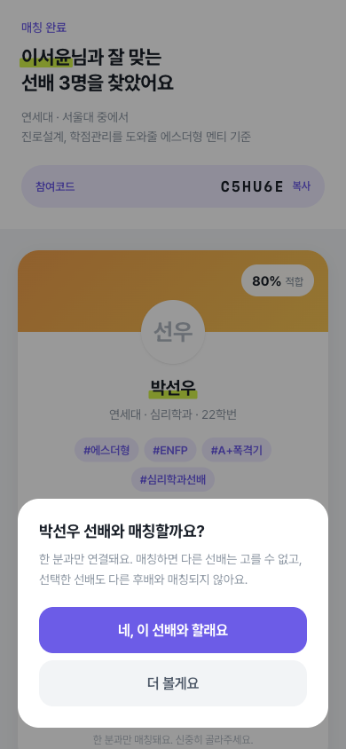 | **매칭 확인** — 한 분과만 연결된다는 점을 누르기 전에 알립니다 |
| 3 | 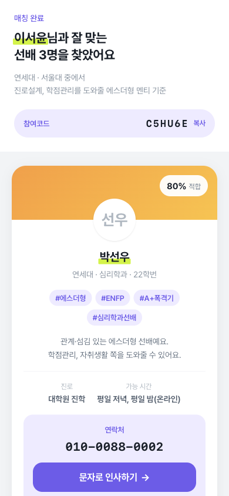 | **연락처 공개** — 첫 인사말이 채워진 문자 링크가 기본 행동입니다 |

---

## 오시는 길

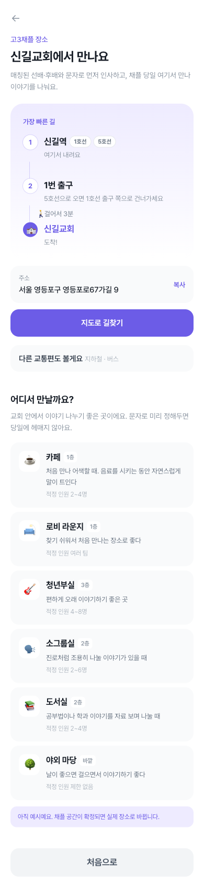

---

## 매칭 알고리즘

`src/features/matching/lib/score.ts` — **UI·DB에 의존하지 않는 순수 함수**입니다.
가중치는 운영하며 조정하게 되므로 한곳에 모아 두었습니다.

### 가중치 (합계 100)

`src/features/matching/lib/score.ts` 의 `WEIGHTS` 가 유일한 출처입니다.

| 항목 | 배점 | 계산 방식 |
| --- | --- | --- |
| 지망 캠퍼스 | **40** | 1지망 40점 · 2지망 32점 · 3지망 24점 |
| 관심 영역 | **20** | 겹치는 비율. 3개 중 3개면 20점, 1개면 6.7점 |
| 시간대 | **15** | 겹치는 구간 수에 비례 |
| MBTI | **10** | 4축 × 2.5점. 같은 글자마다 2.5점 |
| 학과 · 진로 | **10** | 하나라도 겹치면 절반, 전부 겹치면 만점 |
| 성경 인물 | **5** | 같은 유형 5점 · 보완 유형 3.5점 · 그 외 2점 |

**MBTI를 안 적으면 축마다 절반(총 5점)을 줍니다.** 건너뛸 수 있는 항목이라 0점을
주면 안 적은 사람이 모든 멘토에게서 10점을 통째로 잃습니다. 무작위 조합의 기대값이
축당 절반이라, 절반을 주면 유불리 없이 중립이 되고 순위도 왜곡되지 않습니다.

**시간대는 필터가 아니라 점수입니다.** 예전에는 하나도 안 겹치면 후보에서 제외했는데,
그러면 같은 캠퍼스에 관심사까지 맞는 멘토가 시간 한 칸 때문에 사라져 멘티는 "0명"만
보고 이유도 알 수 없었습니다. 일정은 조정할 수 있고 밤 시간대는 온라인이라,
아예 배제하기보다 크게 깎는 편이 낫습니다.

**성경 인물은 완전 불일치에도 0점을 주지 않습니다.** 캠퍼스가 잘 맞는 멘토가
성향 하나 때문에 후보에서 밀리면 안 되기 때문입니다.

**캠퍼스는 필수 필터이기도 합니다.** 지망 밖 멘토는 이미 후보에서 빠지므로,
이 40점이 실제로 가르는 것은 "1지망이냐 3지망이냐"뿐입니다.

### 필수 필터 (하나라도 걸리면 후보에서 제외)

- 지망 캠퍼스에 없는 멘토 — 멘티가 직접 고른 조건이라 그대로 지킵니다
- 연락처가 없는 경우 — 매칭돼도 연결할 방법이 없습니다
- 멘토링을 신청하지 않은 사람 — 등록만 한 분은 후보에 오르지 않습니다
- 이미 다른 멘티와 매칭된 멘토 — 매칭은 1:1입니다

점수를 깎는 게 아니라 **아예 제외**합니다. 만날 수 없는 멘토는 아무리 성향이 잘
맞아도 매칭의 의미가 없기 때문입니다.

### 매칭에 쓰지 않는 정보

**출신 고등학교와 추천인은 수집하지만 점수에 넣지 않습니다.** 사실 확인할 방법이 없어,
적어 낸 값을 그대로 믿고 점수를 주면 표기 차이(`한빛고` vs `한빛고등학교`)나 오타만으로
순위가 흔들립니다. 운영자 표에서 참고용으로만 봅니다.

나중에 반영하려면 ① `WEIGHTS`에 항목을 추가하고 다른 항목을 줄여 합계 100을 유지
② `scoreXxx` 순수 함수를 만들어 `calculateBreakdown`에 더하기 ③ `ScoreBreakdown`
타입에 키 추가 — 순서로 진행하면 됩니다.

### 성경 인물 8종

다윗 · 솔로몬 · 에스더 · 노아 · 느헤미야 · 다니엘 · 룻 · 드보라. 넷만 두었을 때는
"넷 중엔 이게 제일 가깝네"로 고르게 되어 성향 정보로서의 값이 떨어졌습니다.

궁합(보완 관계)은 네 쌍입니다 — 다윗↔솔로몬(저돌↔숙고), 에스더↔다니엘(어울림↔지킴),
노아↔느헤미야(오래 쌓음↔기한 내 완성), 룻↔드보라(곁에서↔앞에서).

> `persona_type` 은 DB enum 입니다. 인물을 더하려면
> `supabase/migrations/2026-09-15-persona-expand.sql` 처럼 SQL 도 함께 실행해야 하고,
> `npm run check:db` 가 적용 여부를 확인합니다.

### 검증

세 가지를 나눠 돌립니다. 배포 전에는 셋 다 통과해야 합니다.

```bash
npm run check:db      # DB 스키마가 코드와 맞는지 (6항목)
npm run verify        # 매칭 알고리즘 (28항목, 2,500조합 전수)
npm run verify:flow   # API·DB·보안 (30항목, 서버 필요)
```

**`npm run verify`** — 멘토 50명 × 멘티 50명을 전수 검사합니다. 가중치 합계,
미반영 항목이 점수에 새어 들어갔는지(소스 직접 검사), 참여코드 유일성, MBTI 유효성,
점수 범위, MBTI 배점(4축 일치·불일치·미입력 중립), 필터 동작, 정렬 순서를 봅니다.

**`npm run check:db`** — 스키마 변경은 SQL Editor에서 사람이 실행해야 해서,
코드만 배포하고 SQL을 잊으면 신청이 통째로 실패합니다. 화면에는 선택지가 멀쩡히
보이므로 원인을 찾기 어렵습니다. 미적용 항목이 있으면 실행할 SQL을 그대로 출력합니다.

**`npm run verify:flow`** — 실제 API를 때려 저장·매칭·연락처 공개·1:1 제약·코드 조회·
운영자 접근 제어까지 확인하고, 검증용 데이터는 끝나면 스스로 정리합니다.

---

## 프로젝트 구조

기능 단위(feature-based)로 나눴습니다. 매칭 로직은 UI와 완전히 분리해 테스트가 가능합니다.

```
src/
├─ app/                          라우팅과 페이지. 로직은 두지 않음
│  ├─ page.tsx                   고3채플 안내 + 등록 시작
│  ├─ onboarding/
│  │  ├─ register/               1단계 (역할 공통)
│  │  ├─ complete/               참여코드 + 멘토링 권유
│  │  ├─ mentoring/{mentee,mentor,complete}/   2단계
│  │  └─ {mentee,mentor}/        예전 주소 → register 로 리다이렉트
│  ├─ matching/result/  venue/  lookup/  admin/
│  ├─ api/{signup,mentoring,match,lookup,admin}/
│  └─ globals.css                디자인 토큰 (Tailwind v4는 CSS에서 테마 정의)
│
├─ components/ui/                도메인 무관 재사용 UI
│  ├─ CtaButton  ProgressBar
│  ├─ Name                       이름 형광펜 강조
│  └─ CodeBadge  Toast           참여코드 클릭 복사 + 알림
│
├─ features/
│  ├─ onboarding/
│  │  ├─ components/steps/       스텝 하나 = 파일 하나
│  │  ├─ components/RoleFunnel   단계(register/mentoring)별 스텝 목록과 제출
│  │  ├─ components/OnboardingFunnel  스텝 순서·진행률·전환
│  │  ├─ components/StepLayout   질문 헤더 + 스크롤 본문 + 고정 CTA
│  │  ├─ hooks/useFunnel
│  │  ├─ lib/{draftStore,draftToProfile,participationCode}
│  │  └─ model/types.ts          ★ 스텝 순서는 여기서만 바꿉니다
│  ├─ matching/
│  │  ├─ lib/score.ts            ★ 순수 함수. 가중치 조정은 여기서만
│  │  ├─ lib/hashtags.ts         카드 표시용 (점수와 분리)
│  │  └─ components/MentorCard
│  ├─ signup/lib/{repository,validate}.ts   ★ DB 접근과 서버 검증
│  ├─ venue/components/          오시는 길 · 만날 장소 · 인스타 링크
│  └─ admin/
│     ├─ components/{AdminDashboard,DataTable}
│     └─ lib/csv.ts
│
└─ shared/
   ├─ constants/
   │  ├─ {domain,persona,mbti,role,privacy,venue}.ts
   │  ├─ campus.ts                     캠퍼스 목록 · 계열 추정
   │  ├─ campusMajors.ts               캠퍼스별 학과 조회 (동적 로딩 대상)
   │  └─ campusMajors.generated.ts     ★ 생성 파일. 손으로 고치지 마세요
   ├─ hooks/useStaggerReveal            순차 등장 애니메이션
   └─ lib/{anime,cn,particle,nameInitials,security/,supabase/,mock/}

scripts/
├─ build-campus-majors.py        대학알리미 공시자료 → 학과 데이터 생성
├─ check-db.ts  verify-matching.ts  verify-flow.ts
└─ seed-demo.ts  reset-data.ts  purge-expired.ts

supabase/
├─ schema.sql                    최초 1회 적용
└─ migrations/                   이후 변경. check-db 가 적용 여부를 봅니다
```

### 설계 판단 몇 가지

- **`shared/constants/persona.ts`가 온보딩 선택지이자 매칭 입력값** — 양쪽에 따로
  두면 반드시 어긋납니다. 궁합 함수도 같은 파일에 둡니다
- **바텀 시트를 쓰지 않습니다** — 시트는 높이가 콘텐츠에 묶여 선택지가 늘어나면 CTA가
  화면 밖으로 밀려나고, 배경 스크롤까지 잠그면 진행할 방법이 사라집니다
- **스텝마다 `key`를 부여** — 없으면 React가 DOM과 상태를 재사용해 이전 스텝의 스크롤
  위치가 남고, 같은 컴포넌트를 쓰는 스텝끼리 선택값이 샙니다
- **고르는 즉시 draft에 반영** — 뒤로 갔다 돌아와도 선택이 남아 있어야 합니다
- **사진이 없으면 이름 글자를 보여줍니다** — 성향 이모지를 쓰면 "사진을 안 올린 사람"이
  아니라 "그 성향인 사람"처럼 읽혀서, 사람을 가리키는 자리에는 이름이 맞습니다
- **프로필 행은 2단계에서 만듭니다** — `mentee_profiles`/`mentor_profiles` 는 캠퍼스가
  NOT NULL 이라 등록만 한 사람의 빈 행을 넣을 수 없습니다. 매칭에 쓰는 정보이므로
  멘토링을 신청할 때 한 번에 만듭니다. 그래서 운영자 목록 질의는 `!inner` 가 아니라
  left join 이어야 합니다 — 안 그러면 등록만 한 분이 명단에서 통째로 사라집니다
- **브라우저는 DB에 직접 붙지 않습니다** — RLS로 전부 막고 서버 라우트만
  `service_role` 로 접근합니다. 로그인이 없어서, 붙이면 멘토 전원의 연락처가 노출됩니다

---

## 현재 한계와 다음 작업

### 서버는 붙어 있습니다

Supabase에 연결돼 있고 신청·매칭·조회가 모두 DB를 씁니다. 다른 기기에서 신청한
사람도 참여코드로 찾을 수 있습니다. 브라우저 저장소(`sessionStorage`)는 온보딩
중간 상태를 들고 있는 용도로만 남았습니다 — 탭을 닫으면 사라지지만, 제출된
내용은 이미 서버에 있습니다.

### 실기기에서 확인되지 않은 것

지금까지의 검증은 대부분 데스크톱 시뮬레이션입니다. 아래는 실제 폰에서만 드러납니다.

| 항목 | 왜 |
| --- | --- |
| 사진 "찍기" | 카메라가 실제로 열리는지 (`capture="user"`) |
| 사진 "고르기" | 실제 사진(2~5MB)이 400KB 제한에 걸리지 않는지 |
| 참여코드 복사 | 클립보드 API는 HTTPS에서만 동작 |
| **문자 인사 링크** | `sms:` 본문 파라미터 구분자가 iOS·안드로이드에서 다름 |
| 키보드·안전영역 | 입력창이 가리지 않는지, CTA가 홈 인디케이터에 닿지 않는지 |

`sms:` 링크는 안드로이드가 `?body=`, iOS가 `&body=` 를 기대해 `?&body=` 형태로
넣었습니다. 본문이 안 채워져도 번호는 들어가지만, 미리 채운 인사말이 이 기능의
핵심이라 양쪽에서 확인이 필요합니다.

### 아직 만들지 않은 것 — QR 진입과 현장 참여 인증

논의했지만 아직 범위에 넣지 않은 기능입니다. 서버가 붙었으므로 이제 구현 가능합니다.

- **QR 2종** — 신청용(`/`)과 현장 인증용. 운영자 화면에 띄워 참가자가 스캔
- **현장 인증 페이지** — 참여코드 6자리를 입력하면 참여 인증
  - 소문자·하이픈 입력 모두 허용 (`4bt-nxf` → `4BTNXF`)
  - 같은 코드로 여러 번 인증해도 기록은 1건
- **운영자 현장 패널** — 인증 완료 명단(실시간 인원), 코드를 잊고 온 참가자를
  이름·연락처 일부로 찾아주는 검색

### 앱 안 채팅을 만들지 않은 이유

매칭된 뒤의 연락은 **문자(`sms:`)와 카카오톡**으로 넘깁니다. 앱 안에 채팅을 두면:

- **알림이 안 갑니다.** 웹앱은 푸시가 어렵고(iOS는 PWA 설치 필요), 답장을 보려면
  사이트를 다시 찾아 들어와야 합니다. 카카오톡은 이미 알림이 울립니다
- **신분증이 참여코드뿐입니다.** 로그인이 없어 6자리 코드가 곧 비밀번호가 되는데,
  이 앱은 그 코드를 "복사해서 저장해두라"고 권하고 있습니다
- **미성년자 보호 책임이 생깁니다.** 고3과 성인 대학생의 1:1 비공개 채팅을 직접
  제공하면 신고·차단·로그 보존과 동의 문구 개정이 함께 따라옵니다

행사 후 버전 2의 후보로 남겨 둡니다.

### 그 외 남은 것

| 항목 | 상태 |
| --- | --- |
| **행사 시작 시각** | 날짜(11/26)만 있고 몇 시인지가 없습니다 |
| **만날 장소** | 화면에 "채플 공간이 확정되면 실제 장소로 바뀝니다" 라고 떠 있습니다 |
| **캠퍼스 CCC 인스타** | `instagram.ts` 가 전부 주석 처리되어 지금은 모두 검색 결과로 보냅니다 |
| **동의 문구 법률 검토** | `privacy.ts` 는 초안입니다. 보유 기간·문의 창구 확정 필요 |
| 사진 저장소 | DB에 data URL로 직접 저장. 1,300명 기준 약 78MB |
| 속도 제한 | 서버 인스턴스별로 따로 셉니다 (Vercel은 인스턴스가 여러 개) |
| 운영자 화면 캡처 | 비밀번호 입력이 필요해 `screenshots/` 에 없습니다 |

위 네 개는 **코드로 해결되지 않습니다.** 운영진이 정해 주어야 채울 수 있습니다.

### 다음 단계

1. **행사 정보 확정** — 시각·장소·인스타 계정. 위 표의 굵은 항목
2. **실기기 점검** — 카메라·클립보드·`sms:` 링크. 배포 후에만 가능합니다
3. **운영진 리허설** — 실제 사람이 무엇을 헷갈려 하는지는 아직 아무도 모릅니다
4. QR 진입 + 현장 참여 인증
5. 동의 문구 확정 (오픈 전 필수)

일정과 순서는 [docs/DEPLOYMENT.md](docs/DEPLOYMENT.md) 를 보세요.
