# CCC 멘토-멘티 매칭

고3 수험생(예비 대학생)과 CCC 재학생을 캠퍼스·관심 영역·성향으로 이어주는 모바일 웹 서비스입니다.

---

## 목차

1. [빠르게 실행하기](#빠르게-실행하기)
2. [화면 구성과 주소](#화면-구성과-주소)
3. [사용자 흐름 ① 고3 학생(멘티)](#사용자-흐름--고3-학생멘티)
4. [사용자 흐름 ② 대학생 CCC(멘토)](#사용자-흐름--대학생-ccc멘토)
5. [사용자 흐름 ③ 이미 신청한 사람 — 참여코드 조회](#사용자-흐름--이미-신청한-사람--참여코드-조회)
6. [운영자 화면](#운영자-화면)
7. [매칭 알고리즘](#매칭-알고리즘)
8. [프로젝트 구조](#프로젝트-구조)
9. [현재 한계와 다음 작업](#현재-한계와-다음-작업)

---

## 빠르게 실행하기

```bash
npm install
npm run dev        # http://localhost:3000
```

| 명령 | 설명 |
| --- | --- |
| `npm run dev` | 개발 서버 |
| `npm run build` | 프로덕션 빌드 |
| `npm start` | 빌드된 결과 실행 |
| `npm run typecheck` | 타입 검사 |
| `npx tsx scripts/verify-matching.ts` | 매칭 알고리즘 검증 (멘토 50 × 멘티 50 = 2,500조합) |

> **주의** — 개발 서버가 떠 있는 상태에서 `npm run build`를 돌리면 `.next`를 덮어써서
> 청크가 깨지고 화면이 반응하지 않습니다. 빌드 전에 개발 서버를 먼저 종료하세요.

**기술 스택**: Next.js 15 (App Router) · React 19 · TypeScript · Tailwind CSS v4 · Anime.js v4

---

## 화면 구성과 주소

| 주소 | 보는 사람 | 설명 |
| --- | --- | --- |
| `/` | 참가자 | 역할 선택 (멘티 / 멘토) |
| `/onboarding/mentee` | 고3 학생 | 멘티 신청 8스텝 |
| `/onboarding/mentor` | CCC 재학생 | 멘토 신청 8스텝 |
| `/onboarding/complete` | 신청자 | 참여코드 발급 |
| `/matching/result` | 멘티 | 매칭된 멘토 카드 |
| `/lookup` | 신청자 | 이름·연락처로 참여코드 조회 |
| `/admin` | 운영자 | 신청 현황·매칭 결과 |

`/admin`은 **참가자 화면 어디에도 링크되어 있지 않습니다.** 참가자에게
관리자 화면이 노출되면 안 되기 때문이며, 운영자는 주소를 직접 입력해 들어갑니다.

---

## 사용자 흐름 ① 고3 학생(멘티)

첫 화면에서 역할을 고릅니다. "멘티로 시작하기"를 누르면 8스텝이 시작됩니다.
한 화면에 질문 하나씩 묻는 토스식 대화형 방식이며, **하단 CTA는 항상 화면에 고정**됩니다.

| | 화면 | 설명 |
| --- | --- | --- |
| 0 | 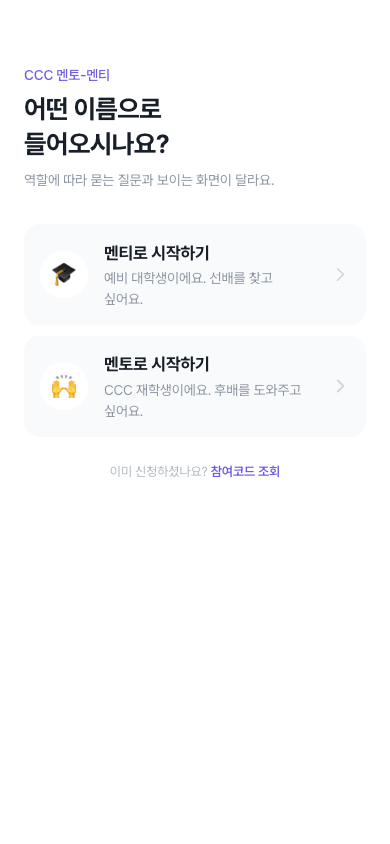 | **역할 선택** — 모든 참가자의 진입 지점 |
| 1 | 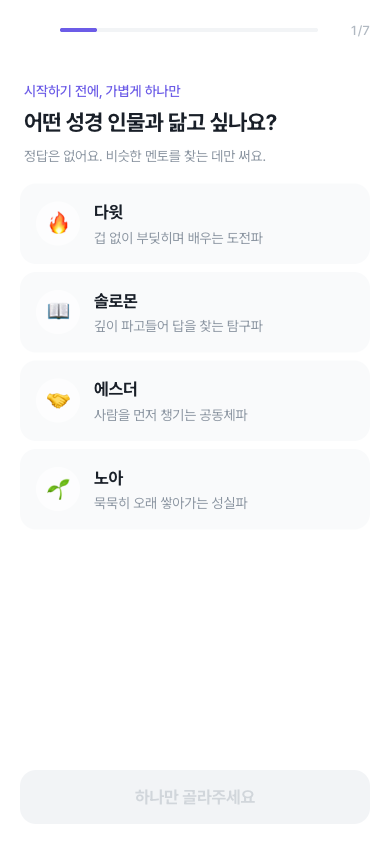 | **아이스브레이킹** — 딱딱한 입력 전에 가벼운 질문부터. 성향은 매칭 2순위에 쓰입니다 |
| 2 | 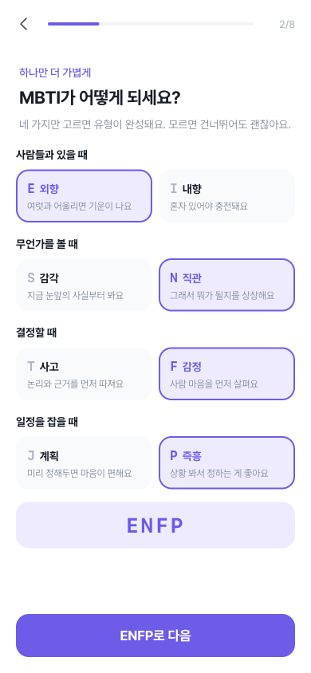 | **MBTI** — 네 축을 하나씩 고르면 유형이 완성됩니다. 모르면 건너뛸 수 있어요 |
| 3 | 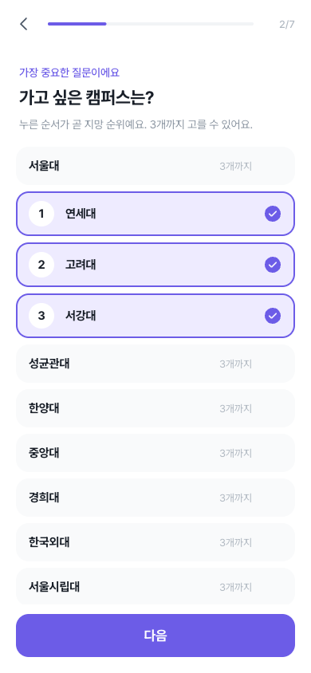 | **지망 캠퍼스** — 누른 순서가 곧 지망 순위(1·2·3). 매칭 가중치 50%로 가장 무겁습니다 |
| 4 | 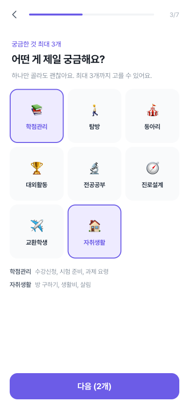 | **관심 분야** — 3열 격자, 최대 3개. 고른 항목의 설명만 아래에 모아 보여줍니다 |
| 5 | 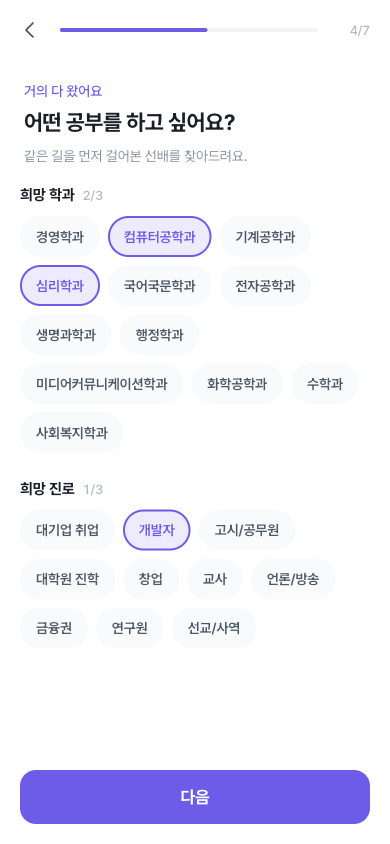 | **희망 학과·진로** — 각각 최대 3개. `0/3` 카운터로 남은 개수를 표시합니다 |
| 6 | 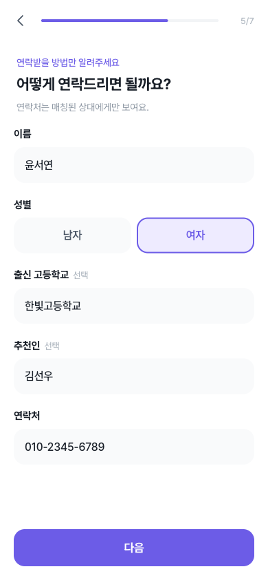 | **프로필** — 이름·성별·연락처는 필수, 고등학교·추천인은 선택 |
| 7 | 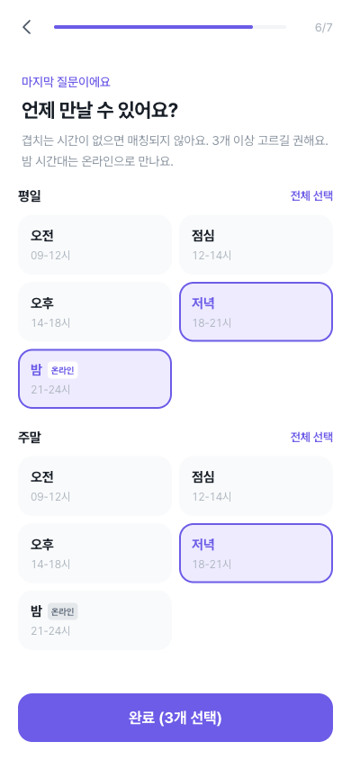 | **가능 시간대** — 평일/주말 × 5구간. **밤(21-24시)은 온라인** 뱃지로 표시 |
| 8 |  | **프로필 사진** — 앨범에서 **고르기** 또는 카메라로 **찍기**. 선택 사항이며, 올리지 않으면 이름 글자만 보입니다 |
| 9 | 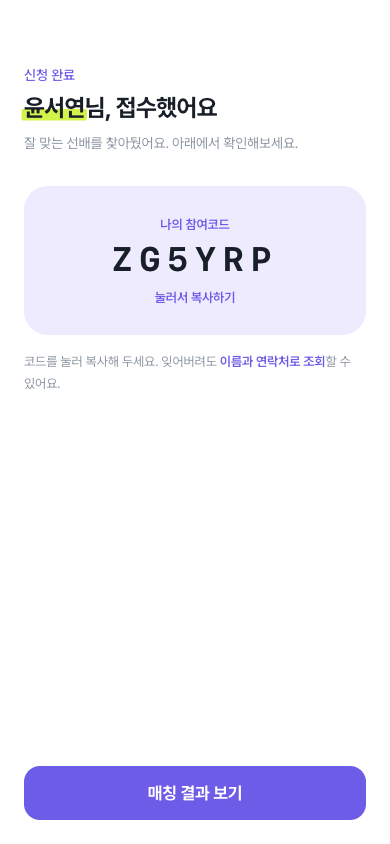 | **신청 완료** — 참여코드 발급. 코드를 누르면 복사됩니다 |
| 10 | 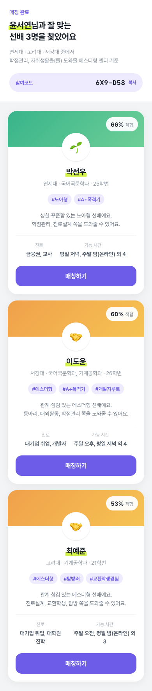 | **매칭 결과** — 적합도 순 상위 3명의 프로필 카드 |

**"최대 3개"는 하나만 골라도 넘어갑니다.** 상한에 도달하면 나머지 항목이 흐려지고,
하나를 해제하면 다시 고를 수 있습니다.

---

## 사용자 흐름 ② 대학생 CCC(멘토)

멘토도 8스텝이지만 **묻는 내용과 선택 방식이 다릅니다.** (성경 인물·MBTI 두 아이스브레이킹은 동일)

| | 화면 | 멘티와 다른 점 |
| --- | --- | --- |
| 1 | 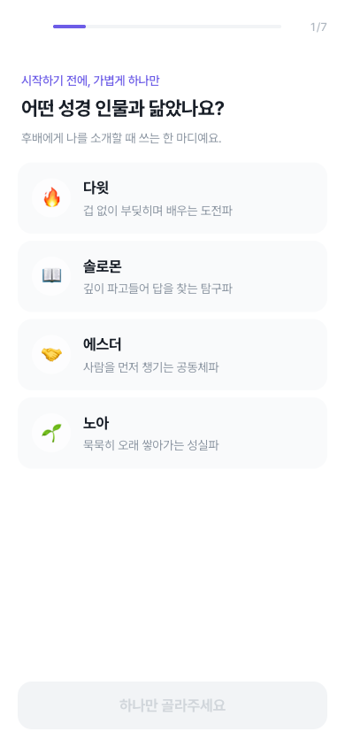 | "닮고 싶나요?" → **"닮았나요?"** (되고 싶은 모습이 아니라 지금의 나) |
| 2 | 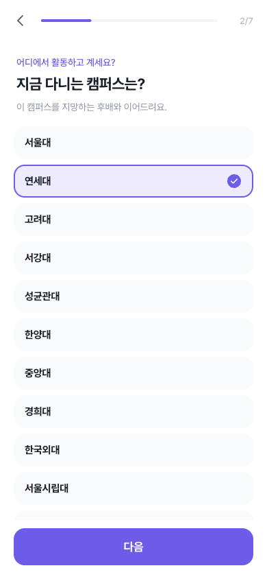 | 3지망이 아니라 **재학 중인 캠퍼스 하나** |
| 3 | 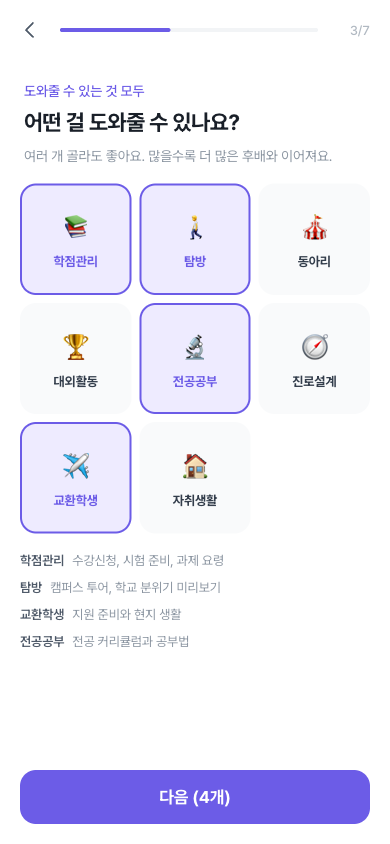 | **개수 제한 없음** — 도울 수 있는 만큼 다 고를 수 있습니다 |
| 4 | 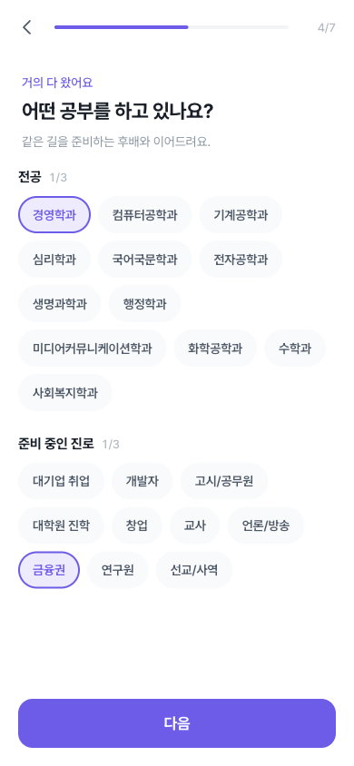 | "희망 학과" → **"전공"**, 복수전공 고려해 최대 3개 |
| 5 | 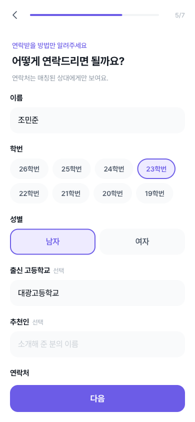 | **학번 입력** (멘티에게는 없는 항목) |
| 6 | 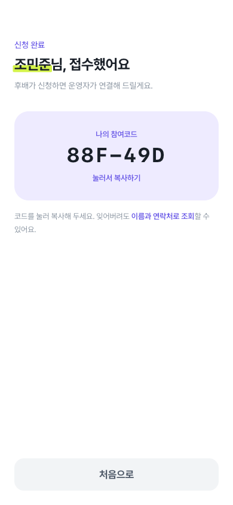 | 매칭 결과 대신 **"운영자가 연결해 드릴게요"** 안내 |

> **학번을 나이 대신 받는 이유** — 나이는 매칭 가중치에 들어가지 않아 신호가 없고,
> 재수·휴학이 흔해 나이로 학번을 역산하면 실제와 어긋납니다. 고3 멘티는 아직 학번이
> 없으므로 멘토에게만 묻습니다.

---

## 사용자 흐름 ③ 이미 신청한 사람 — 참여코드 조회

참여코드를 잊었을 때의 흐름입니다. 진입점은 **랜딩 하단**과 **신청 완료 화면**입니다.

| | 화면 | 설명 |
| --- | --- | --- |
| 1 | 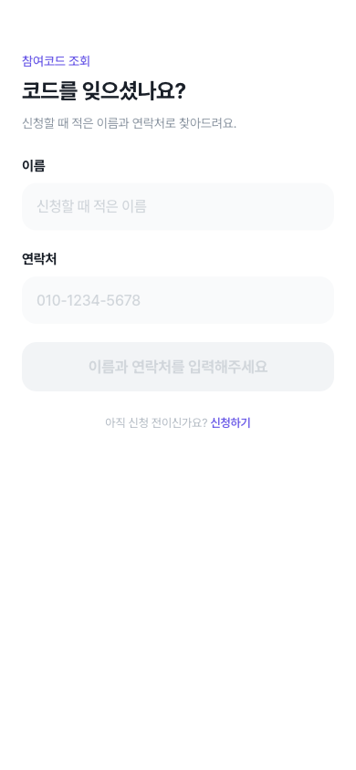 | **코드 조회** — 이름과 연락처 입력 |
| 2 | 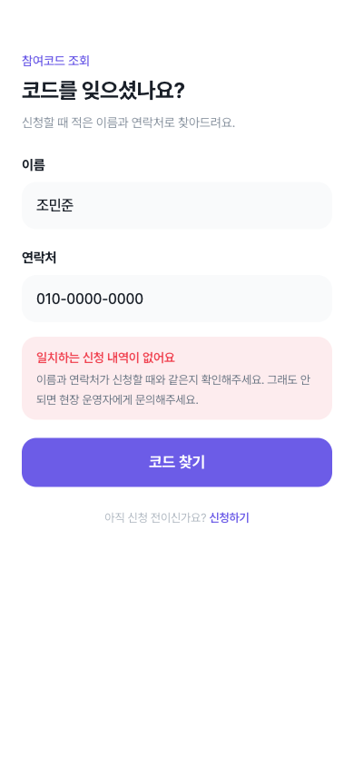 | **조회 실패** — 이름만 맞고 번호가 틀리면 알려주지 않습니다 |
| 3 | 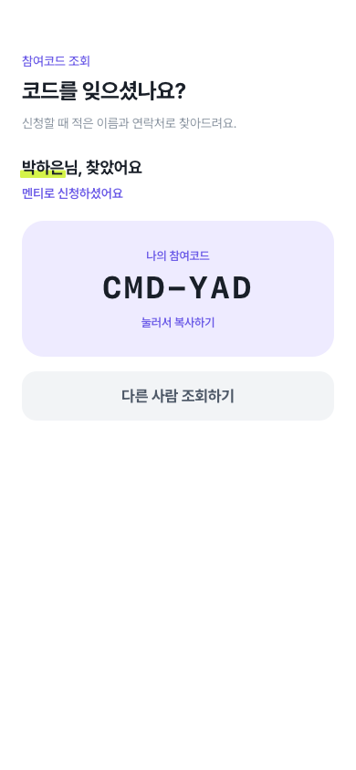 | **조회 성공** — 코드를 눌러 복사 |

### 참여코드 규칙

- **6자리**, `ZG5YRP`처럼 구분 기호 없이 표시 (자간을 넓혀 한 글자씩 또렷하게)
- **혼동되는 글자를 뺐습니다** — `0/O`, `1/I/L` 제외. 전화로 불러주거나 손으로 적는 상황을 전제
- `crypto.getRandomValues` 사용 — 같은 순간에 제출한 두 사람이 같은 코드를 받지 않도록
- 코드를 누르면 클립보드에 복사되고 "메모장이나 메시지에 붙여넣어 두세요" 안내가 뜹니다
- 입력받을 때는 하이픈이 섞여 들어와도 정규화해 통과시킵니다

### 조회는 왜 이름 + 번호인가

이름만으로 조회되면 아무나 남의 참여코드를 볼 수 있습니다. 연락처는 본인만 아는
값이라 **둘 다 일치해야** 알려줍니다. 번호는 하이픈 유무와 무관하게 숫자만 비교합니다.

---

## 운영자 화면

`/admin`으로 직접 접속합니다. 열이 12~13개라 **모바일 셸에 가두지 않고 전체 폭**을 씁니다.

| 화면 | 설명 |
| --- | --- |
| 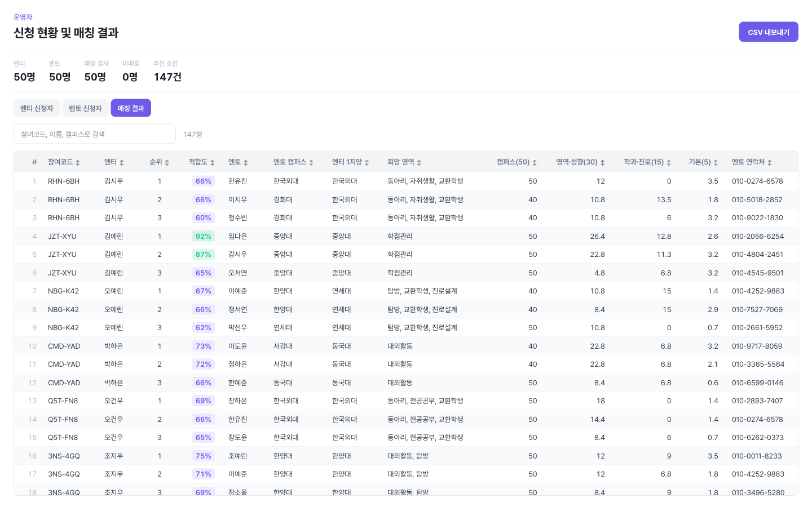 | **매칭 결과** — 멘티별 상위 3명을 한 행씩 펼쳐 보여줍니다. 점수 근거(캠퍼스/영역·성향/학과·진로/기본)가 열로 분리돼 있어 왜 이 순위인지 확인할 수 있습니다 |
| 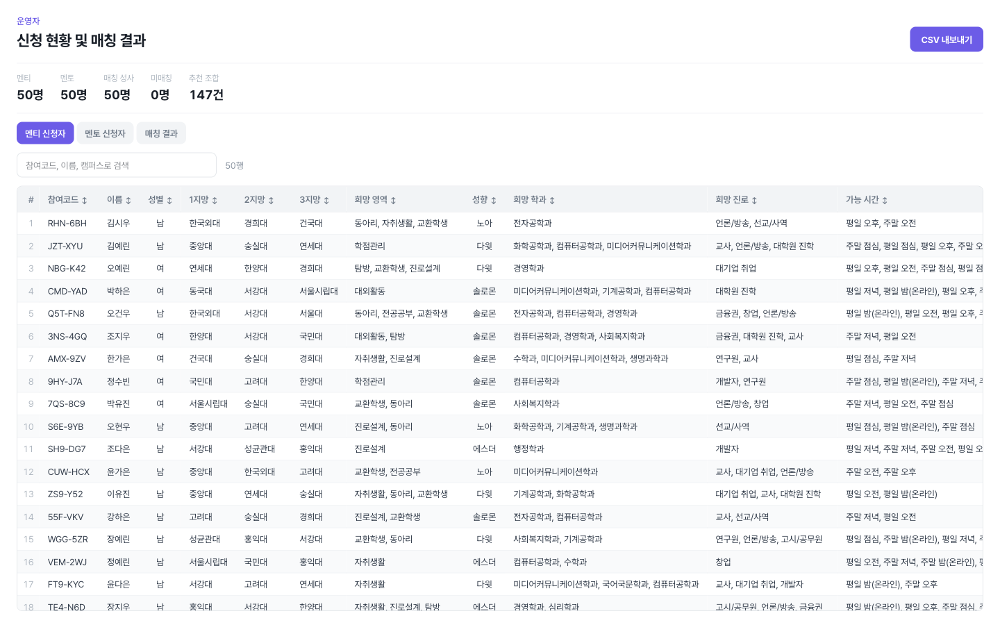 | **신청자 목록** — 멘티/멘토 탭. 헤더 고정·정렬·검색·행번호·얼룩무늬 |

- **CSV 내보내기** — 화면 표와 같은 열 구성으로 떨어집니다. 엑셀에서 한글이 깨지지
  않도록 UTF-8 BOM을 붙입니다

---

## 매칭 알고리즘

`src/features/matching/lib/score.ts` — **UI·DB에 의존하지 않는 순수 함수**입니다.
가중치는 운영하며 조정하게 되므로 한곳에 모아 두었습니다.

### 가중치 (합계 100)

| 항목 | 배점 | 계산 방식 |
| --- | --- | --- |
| 지망 캠퍼스 | **45** | 1지망 45점 · 2지망 36점 · 3지망 27점 |
| 관심 영역 | **20** | 겹치는 비율. 3개 중 3개면 20점, 1개면 6.7점 |
| MBTI | **10** | 4축 × 2.5점. 같은 글자마다 2.5점 |
| 성경 인물 | **5** | 같은 유형 5점 · 보완 유형 3.5점 · 그 외 2점 |
| 학과 · 진로 | **15** | 학과 9점 + 진로 6점. 1개 겹치면 절반, 전부 겹치면 만점 |
| 기본 | **5** | 시간대 겹침 3.5점 + 동성 1.5점 |

**MBTI를 안 적으면 축마다 절반(총 5점)을 줍니다.** 건너뛸 수 있는 항목이라 0점을
주면 안 적은 사람이 모든 멘토에게서 10점을 통째로 잃습니다. 무작위 조합의 기대값이
축당 절반이라, 절반을 주면 유불리 없이 중립이 되고 순위도 왜곡되지 않습니다.

**성경 인물은 완전 불일치에도 0점을 주지 않습니다.** 캠퍼스가 잘 맞는 멘토가
성향 하나 때문에 후보에서 밀리면 안 되기 때문입니다.

**캠퍼스는 필수 필터이기도 합니다.** 지망 밖 멘토는 이미 후보에서 빠지므로,
이 45점이 실제로 가르는 것은 "1지망이냐 3지망이냐"뿐입니다. 그래서 영역에
비중을 더 주면 *조금 먼 학교라도 내가 궁금한 걸 도와줄 수 있는 선배*가
위로 올라옵니다. 예: 3지망(27점) + 영역 완전일치(20점) = 47점이
2지망(36점) + 영역 불일치(0점) = 36점을 앞섭니다.

### 필수 필터 (하나라도 걸리면 후보에서 제외)

- 지망 캠퍼스에 없는 멘토
- 참여 가능 시간대가 하나도 겹치지 않는 경우
- 연락처가 없는 경우

점수를 깎는 게 아니라 **아예 제외**합니다. 만날 수 없는 멘토는 아무리 성향이 잘
맞아도 매칭의 의미가 없기 때문입니다.

### 매칭에 쓰지 않는 정보

**출신 고등학교와 추천인은 수집하지만 점수에 넣지 않습니다.** 사실 확인할 방법이 없어,
적어 낸 값을 그대로 믿고 점수를 주면 표기 차이(`한빛고` vs `한빛고등학교`)나 오타만으로
순위가 흔들립니다. 운영자 표에서 참고용으로만 봅니다.

나중에 반영하려면 ① `WEIGHTS`에 항목을 추가하고 다른 항목을 줄여 합계 100을 유지
② `scoreXxx` 순수 함수를 만들어 `calculateBreakdown`에 더하기 ③ `ScoreBreakdown`
타입에 키 추가 — 순서로 진행하면 됩니다.

### 검증

```bash
npx tsx scripts/verify-matching.ts
```

멘토 50명 × 멘티 50명 = 2,500조합을 전수 검사합니다. 가중치 합계, 미반영 항목이
점수에 새어 들어갔는지(소스 직접 검사), 참여코드 유일성, MBTI 유효성, 점수 범위,
MBTI 배점(4축 일치·불일치·미입력 중립), 필터 동작, 정렬 순서 등
**28개 항목**을 확인합니다.

---

## 프로젝트 구조

기능 단위(feature-based)로 나눴습니다. 매칭 로직은 UI와 완전히 분리해 테스트가 가능합니다.

```
src/
├─ app/                          라우팅과 페이지. 로직은 두지 않음
│  ├─ page.tsx                   역할 선택 랜딩
│  ├─ onboarding/{mentee,mentor,complete}/
│  ├─ matching/result/
│  ├─ lookup/  admin/
│  └─ globals.css                디자인 토큰 (Tailwind v4는 CSS에서 테마 정의)
│
├─ components/ui/                도메인 무관 재사용 UI
│  ├─ CtaButton  ProgressBar
│  ├─ Name                       이름 형광펜 강조
│  ├─ CodeBadge  Toast           참여코드 클릭 복사 + 알림
│
├─ features/
│  ├─ onboarding/
│  │  ├─ components/steps/       스텝 하나 = 파일 하나 (8개)
│  │  ├─ components/StepLayout   질문 헤더 + 스크롤 본문 + 고정 CTA
│  │  ├─ components/OnboardingFunnel  스텝 순서·진행률·전환
│  │  ├─ hooks/useFunnel
│  │  └─ lib/{draftStore,draftToProfile,participationCode}
│  ├─ matching/
│  │  ├─ lib/score.ts            ★ 순수 함수. 가중치 조정은 여기서만
│  │  ├─ lib/hashtags.ts         카드 표시용 (점수와 분리)
│  │  └─ components/MentorCard
│  ├─ lookup/lib/roster.ts        이름+연락처로 참여코드 조회
│  └─ admin/
│     ├─ components/DataTable
│     └─ lib/csv.ts
│
└─ shared/
   ├─ constants/{domain,persona,mbti,role}  온보딩과 매칭이 함께 참조
   ├─ hooks/useStaggerReveal            순차 등장 애니메이션
   └─ lib/{anime,cn,mock/generate}
```

### 설계 판단 몇 가지

- **`shared/constants/persona.ts`가 온보딩 선택지이자 매칭 입력값** — 양쪽에 따로
  두면 반드시 어긋납니다. 궁합 함수도 같은 파일에 둡니다
- **바텀 시트를 쓰지 않습니다** — 시트는 높이가 콘텐츠에 묶여 선택지가 늘어나면 CTA가
  화면 밖으로 밀려나고, 배경 스크롤까지 잠그면 진행할 방법이 사라집니다
- **스텝마다 `key`를 부여** — 없으면 React가 DOM과 상태를 재사용해 이전 스텝의 스크롤
  위치가 남고, 같은 컴포넌트를 쓰는 스텝끼리 선택값이 샙니다
- **고르는 즉시 draft에 반영** — 뒤로 갔다 돌아와도 선택이 남아 있어야 합니다
- **사진이 없으면 이름 글자를 보여줍니다** — 성향 이모지를 쓰면 "사진을 안 올린 사람"이
  아니라 "그 성향인 사람"처럼 읽혀서, 사람을 가리키는 자리에는 이름이 맞습니다

---

## 현재 한계와 다음 작업

### 아직 서버가 없습니다

지금은 브라우저 저장소만 씁니다. 그래서:

| 기능 | 현재 저장 위치 | 한계 |
| --- | --- | --- |
| 신청 내용 | `sessionStorage` | 탭을 닫으면 사라짐 |
| 코드 조회 | 더미 명단 + 이 기기의 신청 | **다른 기기에서 신청한 사람은 못 찾음** |

교체 지점은 격리해 두었습니다 — `draftStore.ts`와 `lookup/lib/roster.ts`의 함수만
API 호출로 바꾸면 됩니다.

### 매칭 결과가 더미 멘토 기준입니다

멘티가 신청하면 실제 입력값으로 매칭되지만, 상대가 되는 **멘토 50명은 더미 데이터**
(`src/shared/lib/mock/generate.ts`)입니다. 시드 기반이라 실행할 때마다 같은 값이
재현되며, 실제 멘토 데이터가 쌓이면 이 모듈을 DB 조회로 교체합니다.

### 아직 만들지 않은 것 — QR 진입과 현장 참여 인증

논의했지만 **이번 범위에서 뺀 기능**입니다. 서버가 없으면 반쪽짜리가 되기 때문입니다.

구상한 내용은 이렇습니다:

- **QR 2종** — 신청용(`/`)과 현장 인증용. 운영자 화면에 띄워 참가자가 스캔
- **현장 인증 페이지** — 발급받은 참여코드 6자리를 입력하면 참여 인증
  - 소문자·하이픈 입력 모두 허용 (`4bt-nxf` → `4BTNXF`)
  - 같은 코드로 여러 번 인증해도 기록은 1건 (중복 입장으로 세면 인원 집계가 틀어짐)
- **운영자 현장 패널** — 인증 완료 명단(실시간 인원), 코드를 잊고 온 참가자를
  이름·연락처 일부로 찾아주는 검색

**왜 미뤘나** — 인증은 참가자가 자기 폰으로 하고 운영자는 노트북에서 결과를 봅니다.
브라우저 저장소만으로는 두 기기가 같은 데이터를 볼 수 없어, 서버 없이는 현장에서
쓸 수 없습니다. 참여코드 발급과 조회는 그대로 두었으므로 서버가 붙으면 이 기능만
얹으면 됩니다.

### 다음 단계

1. **Supabase 연결** — 스키마 설계, RLS 정책, 위 저장소를 서버로 교체
2. **QR 진입 + 현장 참여 인증** — 서버 연결 후 (위 참조)
3. 매칭 확정 흐름 — `매칭하기` 버튼이 지금은 로그만 남깁니다. 연락처 공개 동의와
   `Matchings` 레코드 생성이 필요합니다
4. 운영자 인증 — `/admin`이 주소만 알면 열립니다
